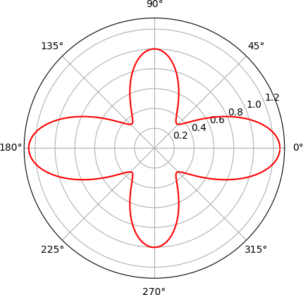

<p align="center">
  
</p>

 
# Angle Dependent Raman Intensity
This repository offers a suite of tools to facilitate `angle dependent Raman spectrocopy` evaluations. 

### How To Use
- Navigate to the `src` directory by using the command `cd src`.
- Ensure you have `input.yaml` with correct keys, e.g. **ramantensor**, **propagationvector**, and **polarizationvector**.
- Among `parallel`, `cross`, and `both` for the configuration setup, select one.
- Run ```python polarized_raman_calculator.py -i input.yaml -conf both``` in your terminal.

### Installation
- `git clone git@github.com:sahashemip/angle-dependent-Raman-intensity.git`
- Ensure you have Python>=3.11 and pip installed on your system. You might also want to create and activate a new virtual environment to keep your global site-packages directory clean and to avoid version conflicts.
- Run `pip install -r requirements.txt` in your terminal, where `./docs/requirements.txt` is located.

### Related
- <https://pubs.acs.org/doi/10.1021/acsomega.9b00712>
- <https://www.nature.com/articles/s41467-019-13504-8>
- <https://journals.aps.org/prmaterials/abstract/10.1103/PhysRevMaterials.3.023806>
